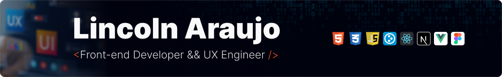

I’m a <b>Frontend Developer</b> who truly enjoys bringing ideas to life through code.  

  

My favorite part of the job is taking a design or concept and turning it into something people can actually use and interact with.

 

I’ve graduated in <b>Software Engineering</b> and also completed a <b>postgraduate in UX Engineering</b>, because I wanted to understand not just <b>how</b> to build software, but also <b>why</b> people use it the way they do.   My curiosity doesn’t stop there — one of my future goals is to pursue a <b>master’s degree in Human-Computer Interaction</b> (HCI) or a related field, so I can go deeper into how people and technology connect.

## ✨ What I enjoy working with  

- **Frontend development**: React, Next.js, Vue, JavaScript, TypeScript, HTML, CSS  
- **Styling**: Sass, Less, TailwindCSS  
- **CMS**: Plone 5 & 6 (Volto)  
- **Design & UX**: Figma, UX Engineering practices, accessibility, usability principles  
- **Other tools**: Node.js, Git, Python basics  
- **What excites me most**: clean, accessible, and user-friendly web experiences  

## 💡 Why I care about UX  

I started diving into design because I wanted to better understand how designers think — and how I could make their ideas real through code. Along the way, I discovered how much **accessibility, usability, and design thinking** matter for creating meaningful digital products.  

## 🛠️ Techs

                          

## 🌟 Favorite Projects

<table>
  <tr>
    <!-- Card 1 -->
    <td align="center" width="300" valign="top"> 
      
        
      <b>UX Guidelines Explorer</b> 
      Next.js • TypeScript • Tailwind • Vitest
        
      <b>More like this:</b> 
      

      ✅ <a href="https://github.com/Lincoln-Araujo/user_system_admin">User Management Admin</a> 
      ✅ <a href="https://github.com/Lincoln-Araujo/user_management_api-backend">User Management API</a>
      

    </td>
    <!-- Card 2 -->
    <td align="center" width="300" valign="top">
      
        
      <b>Canal Educação</b> 
      Figma • Portfolio • UI/UX
        
      <b>More like this:</b> 
      

      🎨 <a href="https://www.figma.com/design/uK8l0AeAgauj3Mqr1HRsB4/Site-EBC?node-id=0-1&t=ZZQl0tGKTZOIjC7N-1" target="_blank">EBC's Institutional Website</a> 
      🎨 <a href="https://www.figma.com/design/YsFU9e72tqjfSy8ZQpjYW7/r%C3%A1dio-gov?node-id=513-2&t=OoHVnDLK3WhNRPln-1" target="_blank">Radio Gov New Theme Website</a>
      

    </td>
    <!-- Card 3 -->
    <td align="center" width="300" valign="top">
      
        
      <b>Portfolio de Fotografia</b> 
      JavaScript • DOM • CSS
        
      <b>More like this:</b> 
      

      🎨 <a href="https://www.figma.com/design/Du059thHLtBolYtMJY0hAl/Site-de-fotos?node-id=132-1936&t=U2rrMzZojSbqKOWd-1" target="_blank">Project on (Figma)</a> 
      ✅ <a href="https://github.com/Lincoln-Araujo/Diagonal-Cascade-Image-Animation">Diagonal Cascade Animation</a>
      

    </td>
  </tr>
</table>

## 🌱 Ongoing journey  

I’m always learning something new. Sometimes it’s a framework, sometimes a design tool, sometimes just a better way to structure code. My goal is to keep growing, stay curious, and contribute to projects that make a difference for people.  

---

### 🌐 Connect with me

