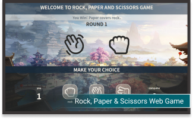
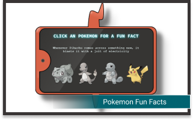

<h1 align="center" > Hi, I'm Lincoln </h1>

<h4 align="center">  FRONT-END DEVELOPER | JAVASCRIPT | REACT | HTML | CSS | UX LOVER <h4>

<h2 align="center" > Some technologies I know: </h2> 
    

 

      
    
<h2 align="center"> My Favorite Repositories </h2>

### You can check other repositories :arrow_right: [here](https://github.com/Lincoln-Araujo?tab=repositories) 

<h2 align="center"> My Achievements as a Developer </h2>

Since I've started to program I have defy myself to learn even more, these are some of the most programming languages that I've used to code some projects: 

However, what is the most important achievement for me is coding since I've decided to become a software Developer. 

Seeing every commit that I've made until today makes me feel proud of myself, coding has changed the way I see my own life in a better way than before.

